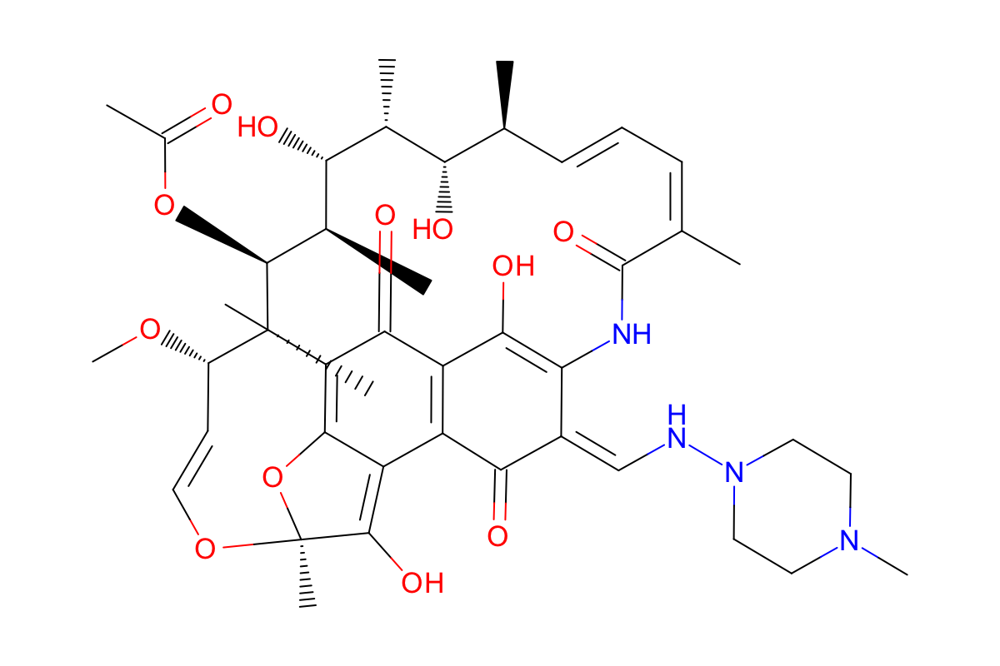

# SAMPL5_083

Molecule 083 is a large macrocyclic compound with many protonation states and tautomers. 
Andreas Klamt discovered a major tautomer other than the one provided in the SAMPL5 challenge. 
This directory is largely Caitlin looking at what the difference between these two tautomers is and making sure both groups were considering the same two tautomers. 

